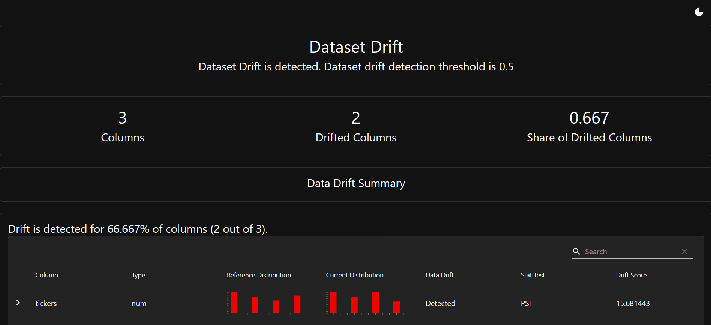
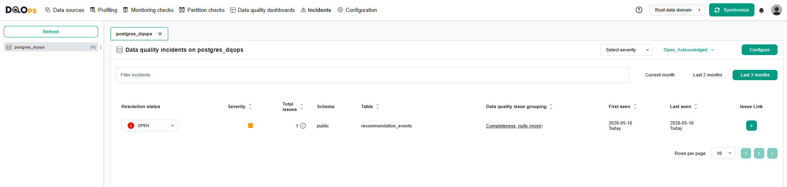

# Шаг 1. Определить ключевые бизнес- и технические метрики. 

Создайте дерево метрик, которое бы учитывало точки зрения разных команд. 
Основной SLO: p95 latency endpoint `/predict` должен быть меньше 1 секунды.

# Шаг 2

# Шаг 3

# Шаг 4
